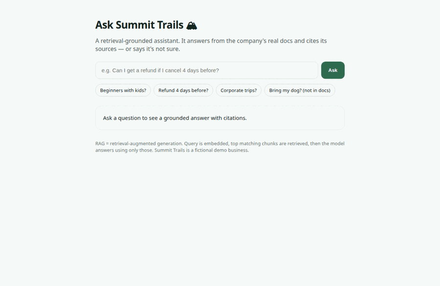

# Summit Trails — Custom GPT / RAG Assistant 🧠

An AI assistant that **actually knows a business** — it answers from the company's own
documents using **retrieval-augmented generation (RAG)**, **cites its sources**, and says
**"I'm not sure"** instead of guessing. Ships two ways: a no-code **Custom GPT** (shareable link)
and a coded **RAG app** (embeddings + retrieval + citations).

> Portfolio demo by **Muhammad Adil** — Principal Software Engineer, ML Specialization (DeepLearning.AI).
> This is the premium gig: few sellers can actually build grounded, cited RAG — most stop at a prompt.

**🔗 Live RAG app:** _add your Vercel URL_
**🔗 Shareable Custom GPT:** _add your ChatGPT share link_ (see `custom-gpt/INSTRUCTIONS.md`)
**▶ Watch (60s):** _add your Loom/YouTube link_

 <!-- add a GIF showing a cited answer + an "I don't know" -->

## Why it's real RAG (not a chatbot with a big prompt)
- **Embeddings + retrieval:** the query is embedded (`text-embedding-3-small`), chunks are ranked by
  cosine similarity, and only the top matches are passed to the model.
- **Citations:** every answer cites `[1] [2]` mapped to the exact source chunk (shown in the UI).
- **Grounded refusals:** off-doc questions (e.g. "Can I bring my dog?") get "I'm not sure, let me
  connect you to the team" — the whole point of doing it properly.
- Scales to real knowledge bases by swapping the inline docs for a vector store (Pinecone/pgvector).

## Architecture
```
question ──► embed ──► cosine rank over chunk embeddings (cached) ──► top-4 chunks
                                                                          │
                                              grounded system prompt ◄────┘
                                                     │
                                              gpt-4o-mini ──► answer + [citations]
```

## Stack
- `lib/docs.js` — knowledge base + chunker (swap for real PDFs/site in a client build)
- `lib/rag.js` — embeddings, cosine similarity, cached index
- `api/ask.js` — retrieve → grounded answer with citations
- `public/index.html` — ask UI showing the answer + source chunks
- `custom-gpt/INSTRUCTIONS.md` — build the no-code shareable Custom GPT

## Run / deploy
```bash
vercel dev          # local
vercel --prod       # deploy
```
Set `OPENAI_API_KEY` in Vercel (chat + embeddings). Summit Trails is a fictional demo business.
